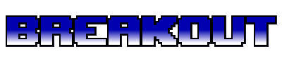

## Creating a Breakout Game
Your PyGame projects can be written in a single file but this often gets very messy and confusing if you want to make changes!

### Check out the example start of a Breakout PyGame!
- Example uses a simple start-menu with two buttons that change color on hover
- Example also utilize a "game over" screen

This program breaks the program up into multiple files to improve scalability and functionality! Explore the program and see how it's organized.

## Included Files
### - main.py
Puts everything together within our main game loop and sets up our event listeners
### - ball.py
Holds the ball class which is derived from the Sprite class
The ball class defines the behavior of the ball, such as speed and where to draw on screen
### - block.py
Holds the Block class for our breakout game.
Each block is defined using the block class and given information for how to draw it such as color, size, and where to draw it on screen
### - constants.py
Serves as a place to hold variables that will be used a lot throughout the program. Creating a constants file can save you time and help to create structure and ease of access in your program.
### - player.py
Holds the Player class, which defines our player bar in breakout.
As the user moves the mouse, the player class manages the intended behaviors of the player bar at the bottom of the screen
### - BreakoutTitle.png
Title image created using Aseperite

## Possible Next Steps
* Create a pause function in game
* Add a visible score
* Refactor code to allow game to be replayed
* Add levels with custom block schemes